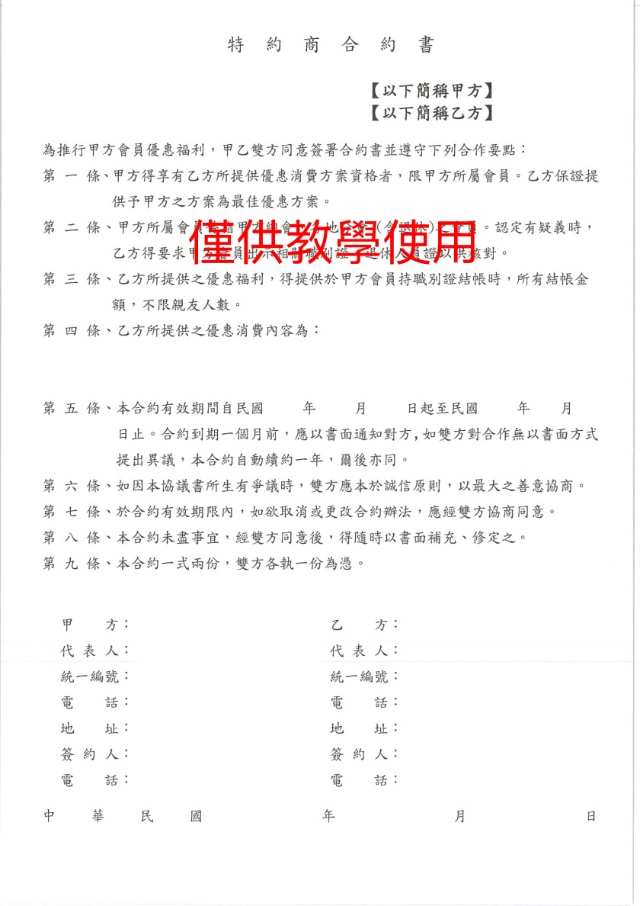

# 介紹

區塊鏈的領域非常的廣，這次主題會著重於 Smart Contract 與 DApp 開發的部分。理論部份，例如共識機制、加密貨幣的原理，仿間已有不少書可以閱讀，將不包含在內這次分享的內容範圍。

這次的主題是會分成四大部分：

1. 介紹與 Smart Contract 相關的基本 blockchain 知識
1. 實際開發 Smart Contract，並編寫程式部署到公開測試鏈上
1. Dapp 開發與 Smart Contract 介接
1. 補充案例說明

在進入到主題之前，我們先瞭解一下，什麼是合約。

### 一般傳統的合約？

下圖是我網路上找到的合約範例

讓我們來看看一般的傳統合約，需要具備哪些基本條件：

1. 甲、乙方資訊
2. 合約條款：大家須遵守的邏輯
3. 合約效期
4. 不可變動性：劃押後，雙方各執一份，不允許在變動。未來有其他需求，需重新定義一份新的合約。

除了基本條件之外，可能還有付款辦法、驗收條件等資訊。

付款項目 | 付款日期 | 付款金額（含稅）
---------|----------|---------
 第一期：簽約金 | 107/01/01 | XXX
 第二期：期中款 | 107/03/01 | XXX
 第三期：尾款 | 107/05/01 | XXX

 從上面的資訊中，若要把整個流程變成自動化，需要做哪些事？

 * 我們需要一個平台，甲乙雙方都需要有帳號，帳號要具有可辨識性，並確保帳號的安全性，不容易被盜用，這樣大家才會認可這個合約的有效性。
 * 我們需要寫一些程式邏輯，來處理合約內容的商業邏輯。
 * 程式邏輯就如同，合約內容簽訂後，沒有人可以在任意再修改。
 * 有一些公司會用支票支付，所以我們也必須要有類似銀行的服務，確保支票可以兌現。

說到著，大家是不是開始覺得頭昏眼花了...

是的，如果在沒有基礎建設的情況下，要自己從頭實作一個可以自動化的合約，是非常困難的。

但好在，我們不需要從頭開始。

### 什麼是 Smart Contract？

中文可翻成為「智能合約」，若用一句話來說，它就是可以在「區塊鏈上執行的程式」。

目前常見的 Smart Contract 是部署在 [Ethereum](https://www.ethereum.org/) 上，又因為它執行在區塊鏈上，所以它天生就繼承了區塊鏈的特性：

1. 去中心化
1. 安全性
1. 開放性 / 透明度
1. 自治性
1. 資料不可篡改
1. 匿名性

並且，享受區塊鏈上實作的一些功能：

1. 整合金流變容易
1. 可以直接使用區塊鏈上已經實作的帳戶機制
1. 不需要固定的主機，只要付 gas。

### 小結

今天我們稍微了解了，若沒有 Ethereum 的基礎建設下，自己實作一個自動化的合約，需要做哪些麻煩事。接下將說明 Ethereum 提供了哪些機制，可以讓我們省掉這些麻煩。