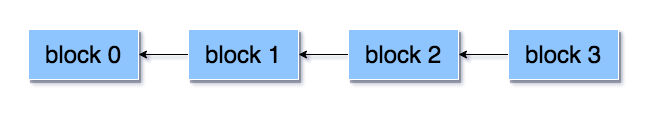
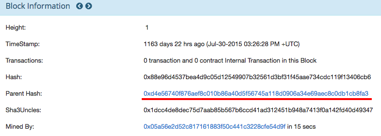
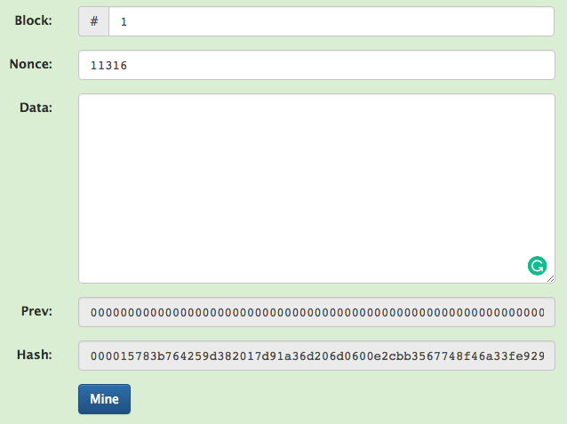
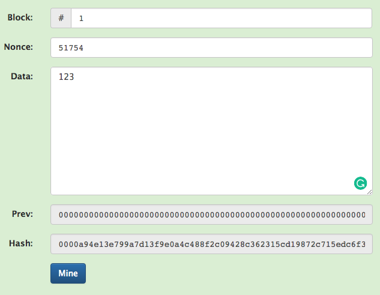
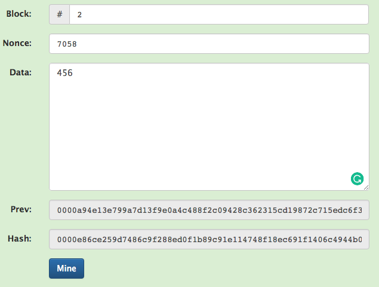
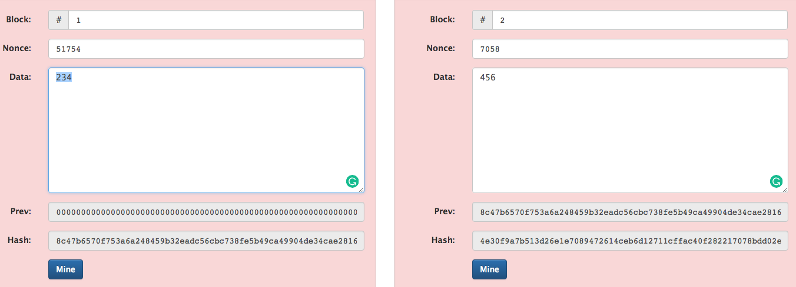
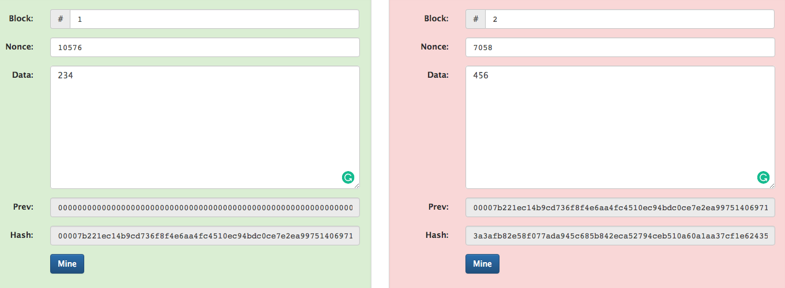

# 區塊 (Block)

blockchain 顧名思義，就是由 block 與 chain 組成，在 Network 中有諸多個 block (區塊)，除了創始區塊之外，每個區塊都有一個 `Parent Hash` 值紀錄著前一個區塊的 `BlockHash`。像一個鍊子一樣，把 block 接在一起。

**創始 block** : <https://etherscan.io/block/0>

**block 1** : <https://etherscan.io/block/1>

### hash

hash 的設計本身是有巧思的，我們可以透過 Anders Brownworth 的 [Blockchain Demo](https://anders.com/blockchain/blockchain.html) 範例來體驗看看。

提醒一下，這個範例只是幫助大家容易理解 hash 驗證機制，非真實 ethereum 的運作的流程。

首先 block 1 沒有任何的 Data，如下圖：

hash 值為 `000015783b764259d382017d91a36d206d0600e2cbb3567748f46a33fe9297cf`

此時我們將 block 1 的 data 設為 123 然後按下 Mine 的按鈕

hash 值變為了 `0000a94e13e799a7d13f9e0a4c488f2c09428c362315cd19872c715edc6f3ad2`

現在我們再將 block 2 的 data 設為 456 然後按下 Mine 的按鈕

block 2 的 hash 值變為了 `0000e86ce259d7486c9f288ed0f1b89c91e114748f18ec691f1406c4944b03b0`

如果這時候，你再回來去修改 block 1 的 data 值。

你就會發現區塊背景變紅色了，這邊想表示的是，當資料被寫入區塊中，當下會生產一個 hash 值，這個 hash 值會被下一個 block 記錄於 `Parent Hash` 值中，若你再去更動 block 的內容，然後按下 Mine 按鈕，

還是無法修復 block 2 的驗證，除非你連 block 2 都重新 Mine 一次，但在真實世界，這個鏈是非常的長的，即使你重新計算了整個鏈的 hash 值，網路上還是有許多節點有備份資料，可否認你資料的真實性。

### 小結

所以我們的 Smart Contract 建構在這樣的環境裡，可以繼承了「資料不可篡改」的好處。目前我們只提到 block，但在實際上，若每一次需要寫入資料，就得用掉一個 block，這樣是不可行的，所以我們還有另一個東西叫 `Transaction`，會由下一篇說明。
