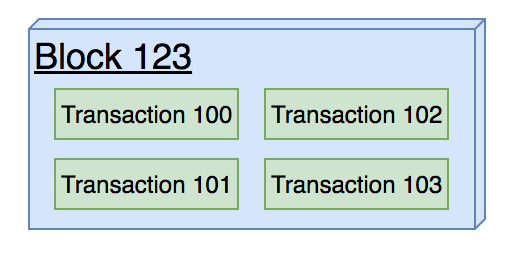
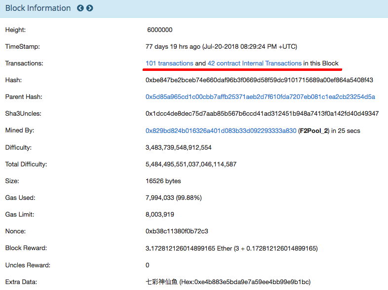
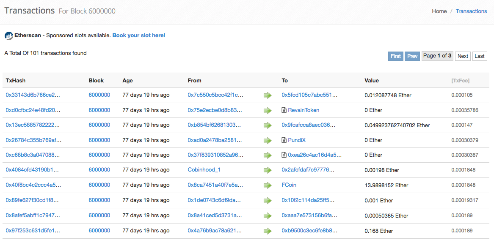
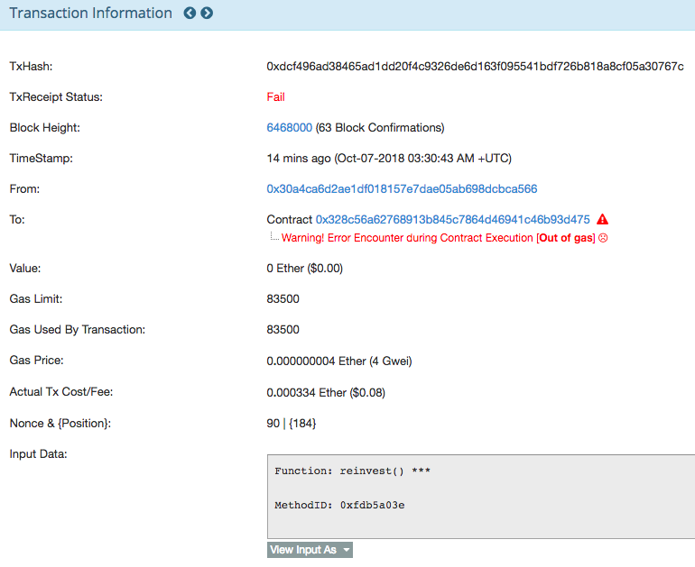
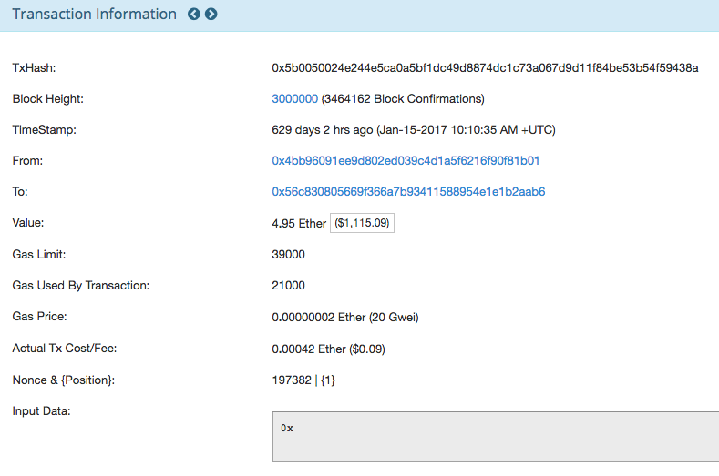
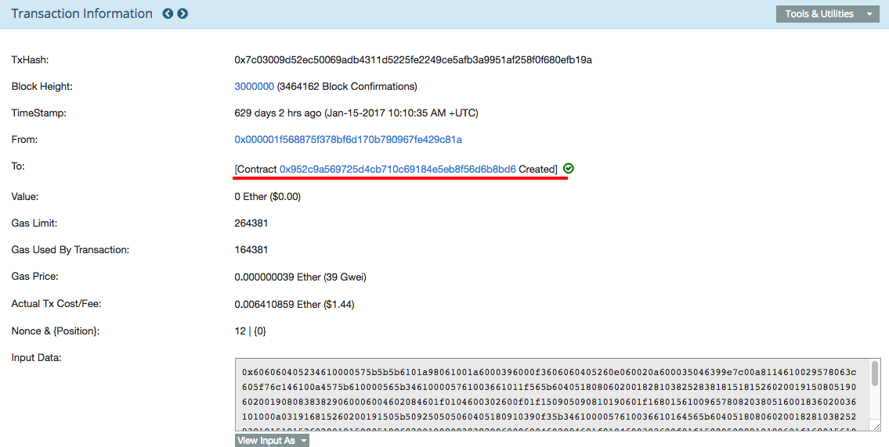
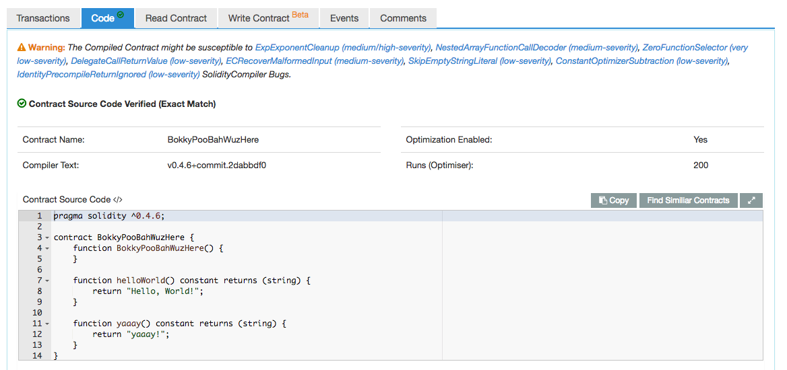
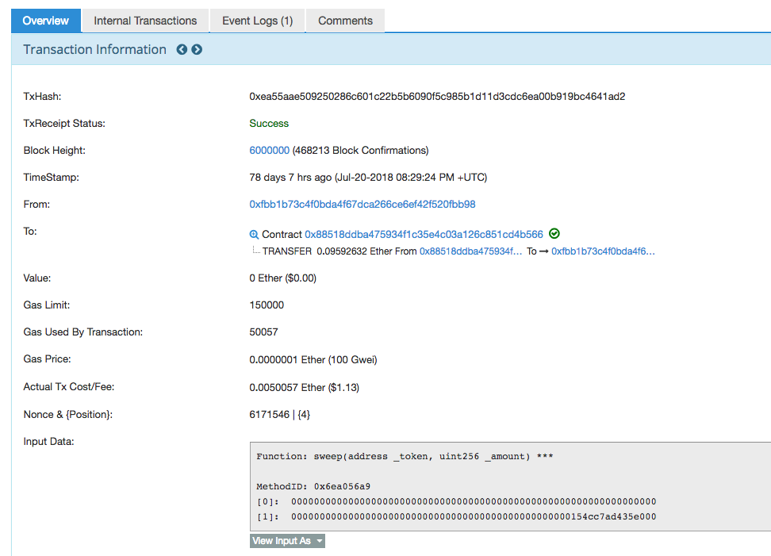

# 交易 (Transaction)

在 blockchain 的世界，需要存任何資料都要寫在鏈上，但產生一個 block 的成本是很高的，除了計算出符合條件的 hash 外，每個節點都需要備份同樣的資料。

圖片來源：<https://etherscan.io/block/6000000>

所以當我們要寫入資料的時候，其實是產生一筆`Transaction`，等一段時間後，才由礦工批次處理，一個 block 是可以同時記錄多筆 `Transaction` 的資料的。如下圖所示，你可以看到 block 6000000 裡面存了 101 筆的 transaction。

圖片來源：<https://etherscan.io/txs?block=6000000>

**Etherscan 是什麼？**

它是一個服務允許您瀏覽和搜索以太坊區塊鏈上的資訊，查看在以太坊上發生的交易記錄 (transaction)、地址 (address)、Token、及鏈上發生的活動資訊。

常見使用情境：
1. 查看ETH錢包餘額
1. 查看交易狀態：有沒有拋出 Error 或狀態為 Fail。
1. 查看帳戶資料

### 常見 Transaction 有三種

[1. 一般轉帳的 Transaction](https://etherscan.io/tx/0x5b0050024e244e5ca0a5bf1dc49d8874dc1c73a067d9d11f84be53b54f59438a)

最常見的 Transaction 類型，就是從 A 帳戶轉錢至 B 帳戶，如下圖所示：

帳號 `0x4bb96091ee9d802ed039c4d1a5f6216f90f81b01` 轉了 4.95 Ether (1,115.09 USD)給 `0x56c830805669f366a7b93411588954e1e1b2aab6`，轉帳手續費 0.00042 Ether (0.09 USD)。

一般你去銀行電匯，發送方成本：匯費 NTD 100 + 郵電費 NTD 300 = NTD 400，接收方成本：也須被扣 NTD 200 手續費，整筆交易會被扣 NTD 600 的手續費。

但如果透過以太幣，卻只要大約台幣 3 塊，現在你應該可以感受到加密貨幣的魅力了。

[2. 發佈 Smart Contract 的 Transaction](https://etherscan.io/tx/0x7c03009d52ec50069adb4311d5225fe2249ce5afb3a9951af258f0f680efb19a)

當要發布 Smart Contract 程式時會將程式進行編碼，寫入至 Transaction 的 `inputData` 值中。如下圖所示：

甚至從合約連結點進去，還可以看到發佈的原始碼。

3. [呼叫 Smart Contract 的 function，所產生的 Transaction](https://etherscan.io/tx/0xea55aae509250286c601c22b5b6090f5c985b1d11d3cdc6ea00b919bc4641ad2)

你甚至可以看到它所呼叫的 function 名稱

### 小結

讀完此篇後，你將具有基本的 Transaction 概念，並懂得在取得 tx-hash 後，透過 etherscan 查詢 Transaction 的資訊。
