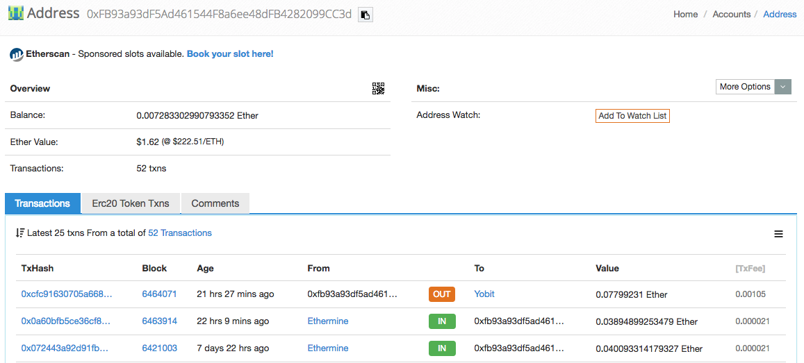

# 帳戶的基本概念

當我們聽到區塊鏈的時候，最常見的形容就是「公開帳本技術」。

帳本是大家最容易理解的原理，因為大家都有銀行戶頭，也常常使用它，當我們要轉帳給某人的時候，我們需要填寫哪些資訊？


[圖片來源 - 東森新聞](https://www.ettoday.net/news/20130207/162668.htm)

* 自己的銀行戶頭號碼
* 對方的銀行戶頭號碼
* 轉帳金額
* 簡短的備註資訊 (可選)

所以「帳戶」在區塊鏈的概念上是一個基礎的元素，每筆 Transaction 都會有 `FROM` 跟 `TO` 兩組帳號，至於 `IN` 代表的則是匯入，`OUT` 代表的是匯出。

就如同下圖所示，一分鐘前你收到了 0.01797717 Ether，然後你又快速地將這筆錢轉出去，所以你的帳戶又歸零了。(0.01780917 的原因是，0.01780917 + 0.000168 (手續費) = 0.01797717)。

### 帳戶型態

因為在 Ethereum 的世界有智能合約，所以帳戶又分兩種型態：

**外部帳戶 Externally owned account**



[圖片來源](https://etherscan.io/address/0xfb93a93df5ad461544f8a6ee48dfb4282099cc3d)

* 簡稱 EOA
* 具有公鑰 (public key) 和 私鑰 (private key)
* 受私鑰所控制，如果弄丟了私鑰，就失去了帳戶的控制權。

**合約帳戶 (Contract address)**



[圖片來源](https://etherscan.io/address/0x06012c8cf97bead5deae237070f9587f8e7a266d)

* 簡稱 CA
* 受智能合約的程式邏輯所掌控
* 每個智能合約在部署後，都會產一個對應的合約帳戶。

不管是 EOA 或合約帳戶，都有賬戶餘額（balance）。

### 小結

你現在應該理解了什麼是帳戶？在 Ethereum 帳戶有哪兩種形式？因為內建了帳戶機制，所以我們開發智能合約，可以直接省略實作個人帳號及「第三方支付」整合，例如：[台灣知名的紅藍綠](https://hsienblog.com/2017/07/17/%E7%B4%85%E9%99%BD%E7%A7%91%E6%8A%80-%E7%B6%A0%E7%95%8C%E7%A7%91%E6%8A%80-%E8%97%8D%E6%96%B0%E7%A7%91%E6%8A%80-%E9%87%91%E6%B5%81%E6%9C%8D%E5%8B%99%E5%95%86%E6%AF%94%E8%BC%83/)，也不需要請會計對賬定期與金流公司請款和扣金流手續費，會比較接近於「電子支付」的概念。

但 Ethereum 還提供了程式語言，讓你可以做更多自動化的應用，例如 ICO、線上博弈等等。