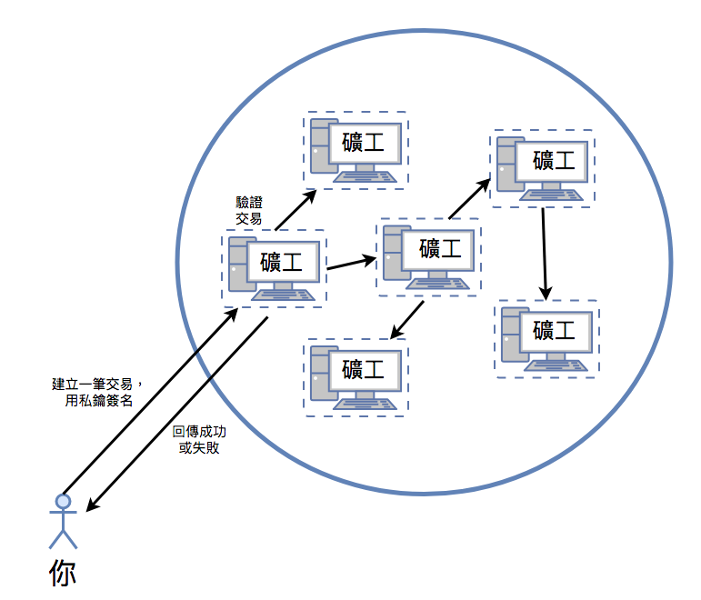

# 帳戶安全

每個帳戶都有公鑰跟私鑰，而位址 (Address) 是由公鑰所決定的，發起交易時，需要使用私鑰簽名，然後礦工用公鑰檢查簽名，確認這筆交易的真假，在再把資料寫入區塊中，而區塊則會被傳遞至各個節點。



### 產生過程

從 [ethereumjs](https://github.com/ethereumjs/ethereumjs-util/blob/master/index.js) 的原始碼可以了解到，私鑰就是一個 16 進位的 32 位數的亂數。

```js
const randomBytes = require('randombytes');
const privateKey = randomBytes(32);
```

公鑰是用私鑰算出來的

```js
const secp256k1 = require('secp256k1');

/**
 * Returns the ethereum public key of a given private key
 * @param {Buffer} privateKey A private key must be 256 bits wide
 * @return {Buffer}
 */
const privateToPublic = exports.privateToPublic = function (privateKey) {
  privateKey = exports.toBuffer(privateKey)
  // skip the type flag and use the X, Y points
  return secp256k1.publicKeyCreate(privateKey, false).slice(1)
}
```

地址則是從公鑰算出來的

```js
/**
 * Returns the ethereum address of a given public key.
 * Accepts "Ethereum public keys" and SEC1 encoded keys.
 * @param {Buffer} pubKey The two points of an uncompressed key, unless sanitize is enabled
 * @param {Boolean} [sanitize=false] Accept public keys in other formats
 * @return {Buffer}
 */
exports.pubToAddress = exports.publicToAddress = function (pubKey, sanitize) {
  pubKey = exports.toBuffer(pubKey)
  if (sanitize && (pubKey.length !== 64)) {
    pubKey = secp256k1.publicKeyConvert(pubKey, false).slice(1)
  }
  assert(pubKey.length === 64)
  // Only take the lower 160bits of the hash
  return exports.keccak(pubKey).slice(-20)
}
```

備註：[keccak = SHA-3](https://www.schneier.com/blog/archives/2013/10/will_keccak_sha-3.html)

```js
const crypto = require('crypto');
const eth = require('ethereumjs-wallet');
const random_hash = crypto.randomBytes(32);
const instance = eth.fromPrivateKey(random_hash);
console.log('私鑰：', instance.getPrivateKey().toString('hex'));
console.log('公鑰：', instance.getPublicKey().toString('hex'));
console.log('地址：', instance.getAddress().toString('hex'));
```

### 相關名詞解釋

* 私鑰 (Account Private Key)：32 個字，16 進位數字，用來發送交易和簽名。
* 公鑰 (Account Public Key)：64 個字，用來驗證交易的真假。
* 地址 (Account Address)：你可以將地址告訴別人，讓他照這個地址轉 Ether 給你。

#### 密碼 (Password)

你可能會有點疑惑，我們已經有了私鑰，為什麼還要密碼，私鑰跟密碼的意義不是差不多嗎？我們剛剛有提到，私鑰是 32 個沒意義的字，非常難記憶，但如果太短的話，安全性又不好。

所以我們需要一組可自訂並容易記憶的密碼，通常限制為至少 8 碼以上，常使用於當你 MetaMask 閒置太久後，它會要求你輸入這組密碼，讓電子錢包重新回復到激活的狀態。


[圖片來源 truffle](https://truffleframework.com/docs/truffle/getting-started/truffle-with-metamask)

#### 助記碼 (Mnemonic Code) / 種子 (Seed)

通常是 12 或 24 個隨機的字詞，只要透過原本建立帳戶的服務商(Metamask、硬體錢包設備...)，輸入密碼和助記碼，就可以回復出原本的私鑰。

**為什麼回復私鑰要搞的這麼複雜？**

因為私鑰在帳戶建立之後，就不能再更動，它又跟公鑰與地址習習相關，不像一般網站的帳號機制，弄個忘記密碼的功能，重新產生一組亂數密碼，寄到你信箱就沒事了。


[圖片來源 truffle](https://truffleframework.com/docs/truffle/getting-started/truffle-with-metamask)

安全建議：備份助記碼，但密碼記在腦中，或備份在離線裝置，使用類似硬體錢包、紙錢包的服務。

### 小結

你應該瞭解了跟帳戶相關的一些專有名詞、使用情境及整個機制的產生過程。帳戶在 Dapp 跟智能合約溝通的時候，經常會用到帳戶，所以我們勢必得先了解它。
