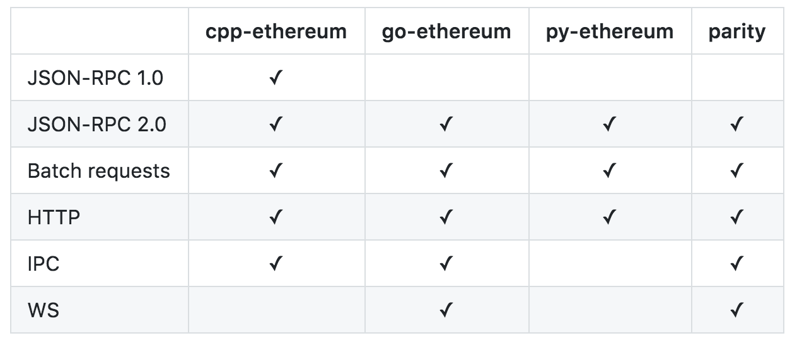

# 用戶端 (Client)

當我在閱讀網路上零散的文章來學習區塊鏈的時候，當看到 `Geth` 字眼都會充滿疑惑，有些文章說 `Geth` 是 `implement ethereum`，有些又說它可以當錢包，又說它是節點程式，甚至可以挖礦，到底是怎麼一回事？

基本上不管是 `Geth` 或 `Parity` 都是用戶端，只是說有些專案提供除了讓程式呼叫的 `API` 之外，還有提供互動的 `commend cli` 或友善的圖形介面(例如 `Parity UI`)。希望透過這篇文章，大家可以更容易理解一點。

目前最受歡迎的用戶端是 `go-ethereum` 和 `Parity`，但幾乎每種語言都有實作以太坊協定的相對應專案，用戶端是用來與以太坊網路溝通的模組。

**常見功能**

* 帳戶管理
  * 建立帳戶
  * 管理帳戶
  * key 匯入
* 交易
  * 進行轉帳
  * 查詢餘額
* 區塊
  * 挖礦
  * 作為一個節點，同步區塊資料。
  * 將交易寫入至區塊鏈中
  * 查詢區塊內容
  * 驗證區塊
* 智能合約
  * 編譯智能合約
  * 執行智能合約
  * 部署智能合約
* 做為 `HTTP-RPC` 伺服器

**常見支援的協定**

* `JSON-RPC` 2.0
* `HTTP` 協定
* `WebSocket` 協定
* `IPC Socket` 協定



```sh
curl -X POST --data '{"jsonrpc":"2.0","method":"net_version","params":[],"id":67}'
```

回應的結果

```json
{
  "id":67,
  "jsonrpc": "2.0",
  "result": "3"
}
```

`result` 值是 3，這裡指的 3 是指網路編號，網路編號 3 是 `Ropsten` 測試網。

### go-ethereum

* 簡稱 `Geth`
* 使用 `GO` 語言 (Golang)
* 由以太坊官方團隊所維護跟實作
* 介面
  * `Javascript Console`
  * [JSON-RPC server](https://github.com/ethereum/wiki/wiki/JSON-RPC)
* 官網：<https://geth.ethereum.org/>
* Github：<https://github.com/ethereum/go-ethereum>
* 文件：<https://github.com/ethereum/go-ethereum/wiki/geth>

### Parity


* 使用 `Rust` 語言
* 最快最輕量的用戶端，不用下載全部的區塊鏈資料，就可以快速地進行節點的同步。
* 官網：<https://.arity.io/>
* Github：<https://github.com/paritytech/parity>
* 文件：<https://wiki.parity.io/>

### Ethereumjs

* 使用 `Javascript` 語言
* Github：<https://github.com/ethereumjs>
  * <https://github.com/ethereumjs/ethereumjs-client>
  * <https://github.com/ethereumjs/ethereumjs-tx>
  * <https://github.com/ethereumjs/ethereumjs-util>
  * <https://github.com/ethereumjs/ethereumjs-wallet>

### 小結

若你想開發一個錢包的 `Dapp`，你可以選擇別人已經重新包過的輕量級 `wallet` 函式庫，但如果要開發比較重量級的功能，最終你還是得直接跟這些模組整合。

除此之外，不想每次建立一筆 Transaction，就得透過 `MetaMask` 按一次交易確認，你肯定會需要用 `unlockaccount` 功能。