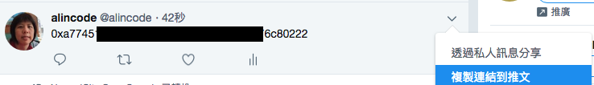

# 網路 (Network)

什麼是網路？首先我們必須要先從節點說起，廣義的來說只要具有連線能力的設備，且它會跟其他設備溝通，就算是一個節點。而成群的節點，就形成一個網路。

每次發佈智能合約都需要花發少許的 Gas，而 Gas 是用以太幣 (Ether) 計價的。程式發佈後就不能在更動裡面的邏輯，所以每次合約發布前都必須經過非常嚴謹的測試。

因故我們絕對不會想使用主網路 (正式環境) 來測試我們的程式，所以除了主網路之外，還會提供多種測試網路可以使用。

### 網路的類型

#### 主網路 / 主鏈 (mainnet)

* 簡稱「主網」
* 是正式環境 (production)，裡面的幣值具有實際經濟價值，是真實的數位貨幣。
* networkid 編號為 1
* 查看狀態
  * <https://etherscan.io/>
  * <https://ethstats.net/>

#### 測試網路 / 測試鏈
  
* 簡稱「測試網」
* 發佈在主網前的最後測試，使用於 Staging 階段。
* 位於公開網路中

**Rposten**

* networkid 編號為 3
* 使用 Pow 共識機制
* 查看狀態：<https://ropsten.etherscan.io/>
* 取得測試幣
  * <https://faucet.ropsten.be/>
  * <https://faucet.metamask.io/>

**Kovan**

* networkid 編號為 42
* 由 Parity 團隊所創造，僅 Parity 用戶端 (client) 可以使用這個測試網路
* 使用 PoA (Proof-of-Authority) 共識機制
* 查看狀態：<https://kovan.etherscan.io/>
* 取得測試幣：<https://github.com/kovan-testnet/faucet>

**Rinkeby**

* networkid 編號為 4
* 由 go-ethereum 團隊所創造
* 使用 PoA 共識機制
  * [Clique PoA protocol - Issue#225 ethereum/EIPs](https://github.com/ethereum/EIPs/issues/225)
* 查看狀態
  * <https://rinkeby.etherscan.io/>
  * <https://www.rinkeby.io/#stats>
* 取得測試幣
  * <https://faucet.rinkeby.io/>


> 補充說明：faucet service 又稱水龍頭，可以透過它來取得測試幣。

**取得測試幣，以 Rinkeby 為例**

Step 1：複製你的位址


Step 2：把位址發佈到 `Twitter`，然後複製連結。



Step 3：把連結貼到 `rinkeby` 的水管服務中，然後按 `Give me Ether` 按鈕，選擇需要多少幣。


#### 私有網路 / 私有鏈 (testnet)

* 簡稱「私網」
* 可以由你自己創造，規則你可以自己訂，與主鏈不相關，所以資料都是獨立的。
* 可以只用本機環境

**使用 Geth**


```
// 在本機建立一個開發網，創建時會預先建立好一個帳戶。
geth --datadir ./devent --dev console

// 預設帳戶的地址
eth.accounts[0]

// 查詢帳戶裡面有多少錢
eth.getBalance(eth.accounts[0])
```

### 網路編號

```
0: Olympic, Ethereum public pre-release testnet
1: Frontier, Homestead, Metropolis, the Ethereum public main network
1: Classic, the (un)forked public Ethereum Classic main network, chain ID 61
1: Expanse, an alternative Ethereum implementation, chain ID 2
2: Morden, the public Ethereum testnet, now Ethereum Classic testnet
3: Ropsten, the public cross-client Ethereum testnet
4: Rinkeby, the public Geth PoA testnet
8: Ubiq, the public Gubiq main network with flux difficulty chain ID 8
42: Kovan, the public Parity PoA testnet
77: Sokol, the public POA Network testnet
99: Core, the public POA Network main network
7762959: Musicoin, the music blockchain
61717561: Aquachain, ASIC resistant chain
[Other]: Could indicate that your connected to a local development test network.
```

資料來源：[stackexchange - How to select a network id or is there a list of network ids?](https://ethereum.stackexchange.com/questions/17051)

### 小結
讀完這節後，你應該要知道各種網路類型及使用情境，並且要知道怎麼取得測試幣，這樣你的戶頭才會有錢可以發佈智能合約。