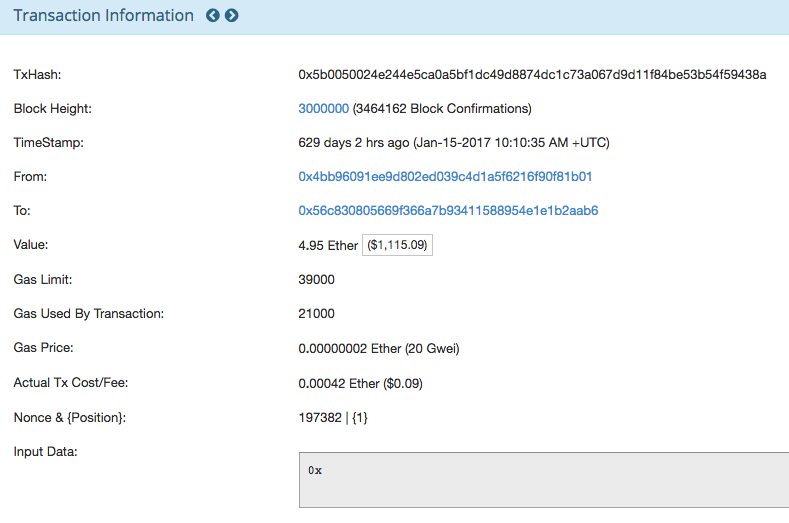

# 什麼是 Gas

`Gas` 是一個非常重要的觀念，即使你不開發智能合約，當你買賣以太幣或轉以太幣給別人，都會需要使用到。

當智能合約智能合約要上線的時候，你不需要租一台固定的主機，在上面部署你的程式，智能合約是部署在區塊鏈上的，每當有人呼叫合約裡的函式，將會透過礦工的資源來執行函式，修改狀態後，將結果再次寫入區塊鏈中(建立一筆交易紀錄)，呼叫合約的人只需要負擔交易手續費，就可以了。

交易手續費是由 `gas limit` 和 `gas price` 兩個值來決定，所以每筆交易都一定要包含這兩個值。

### Gas Price

代表你願意支付 `Gas` 的單價，以 `gwei` 為單位，在交易中 `Gas Price` 是交易發起人決定的，但礦工會依照  `Gas Price` 的高低，決定處理交易的優先權，如果你訂的單價比較低，交易手續費會比較省，但交易會比較慢被處理。

### Gas Limit

允許最多消耗多少 `Gas` 為上限

### 常見情境

**Gas 不足**

在這種情況下交易失敗，交易之前所有修改的狀態會被回復到前一個狀態，並且交易費會被沒收。

以智能合約為例，若函示前兩行是修改變數值，執行到第三行時，你的 `Gas` 沒了，那之前改的變數會恢復到之前的值。

以下面的圖為例，`0.08 Ether` 的交易手續費也會被礦工收走，像是沒有功勞也有苦勞的概念。雖然只做了一半，因為你設定的 `Gas Limit` 太低，沒把交易完成，但你實際還是用到了礦工的資源。


**Gas limit 估算太高**

若實際上不需要消耗掉那麼多的 Gas，剩餘的部分會退回，不會損失。

### 交易手續費計算方式



```
預估交易費 = Gas Limit * Gas Price
```

```
實際交易費 = Gas Used * Gas Price
```

以上面的圖為例

* Gas Price 是 20 Gwei (= 0.00000002 Ether)
* Gas Limit 是 39000
* Gas Used 是 21000

```
預估交易費 = 39000 * 0.00000002 Ether = 0.00078 Ether
實際交易費 = 21000 * 0.00000002 Ether = 0.00042 Ether
大多等於 0.09 USD 或 2.7 TWD
```

### 查詢 Gas 狀態

Ethereum GAS Tracker：<https://etherscan.io/gastracker>


ETH Gas Station：<https://ethgasstation.info>


這裡面有一個[計算機](https://ethgasstation.info/calculatorTxV.php)，可以快速幫出建議的轉帳手續費設定參考值。


### Gas 單位表

這裡只列出常見的幾種，如果想查詢全部的單位，可以看黃皮書。

Unit | Wei Value | Wei
-----|-----------|----
wei | 1 wei | 1
Kwei (babbage) | 1e3 wei | 1,000
Mwei (lovelace) | 1e6 wei | 1,000,000
Gwei (shannon) | 1e9 wei | 1,000,000,000
microether (szabo) | 1e12 wei | 1,000,000,000,000
milliether (finney) | 1e15 wei | 1,000,000,000,000,000
ether | 1e18 wei | 1,000,000,000,000,000,000

### 每個指令所需的 GAS 數量


* 每一個交易的基本費是 21000 Gas

資料來源：[黃皮書第 25 頁](https://ethereum.github.io/yellowpaper/paper.pdf)

### 小結

如果你之前沒接觸過區塊鏈，`Gas` 對你可能會是一個很新奇的觀念，因為我們已經習慣了，網路上的資源是由供應服務商買單，例如供應服務商租月費主機或依照使用掉的資源量計費。智能合約則是以實際使用服務的人收費的(一般使用者)。