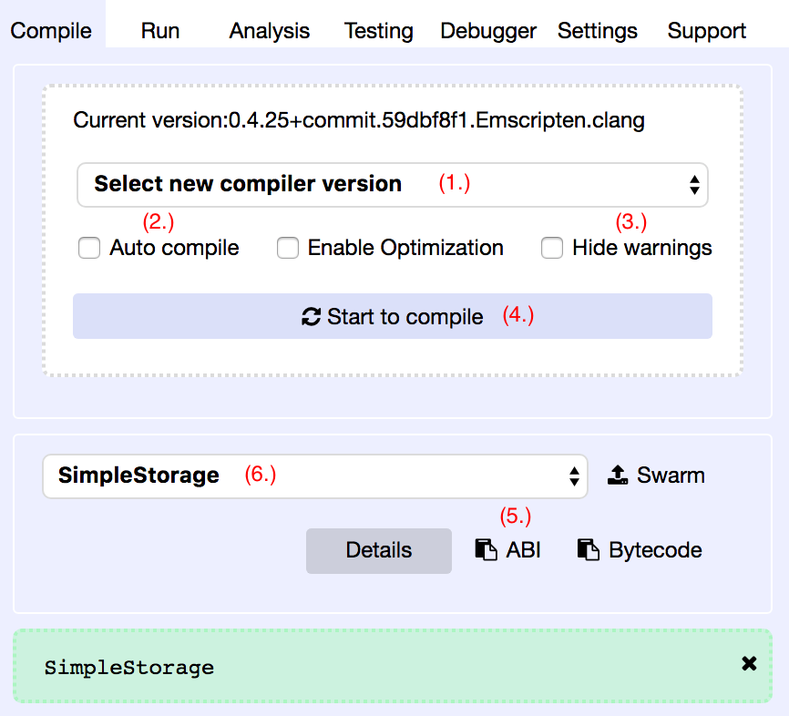
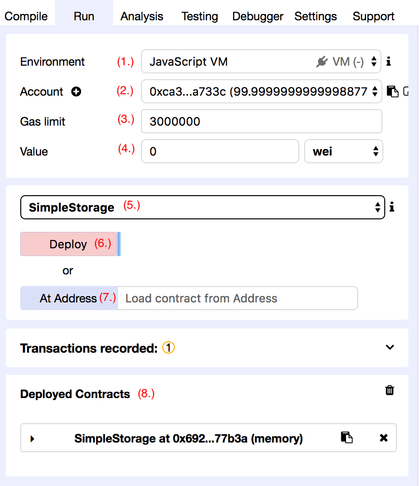

# 線上版 IDE 之 Remix 基礎篇

我們現在來準備開發環境吧！以太坊非常佛心的提供了線上版的 `IDE` 叫 `Remix`，除了 Remix 之外，我們也可以使用目前非常夯的 [`VS Code`](https://code.visualstudio.com/download) 來開發。

* 官方提供線上版的 IDE：<http://remix.ethereum.org>
* Github：<https://github.com/ethereum/remix-ide>
* 文件：<https://remix.readthedocs.io/en/latest/>

**區塊說明**


1. 檔案總管
2. 編輯區
3. 控制台 (console)
4. 諸多功能之頁籤

**安裝本機版**

線上版的 `Remix` 畢竟是多人共用，如果你覺得太慢，可以裝本機端的 `Remix`，步驟非常的簡單。

```sh
npm install remix-ide -g
remix-ide
```


然後開啟 `http://localhost:8080/`

### 編譯頁籤 (Compile)



#### 1. 選擇編譯的版本


#### 2. Auto compile

自動編譯：如果你把這個選項打勾，每當程式碼有修改或其他條件會需要重新編譯的情況時，就會觸發自動編譯功能。

> 建議使用本機版 `Remix` 時才勾起這個選項

#### 3. Hide warnings

隱藏警告訊息：若出現黃色區塊的文字提示，代表是警告訊息，例如你使用未來會被 `deprecated` 的 Solidity 語法。


#### 4. Start to compile


手動編譯：若你沒勾選自動編譯功能，代表每次變動後都必須要手動按這個按鈕，才能確認編譯的結果。

#### 5. ABI (Application Binary Interface)

`ABI` 裡記載了智能合約提供哪些函式，以及應該要傳入什麼樣的參數。當你要開發 `DApp` 時，需要兩個值，才能跟智能合約溝通，一個是合約位址，另一個就是一個是 `ABI` 了。如果需要更深入了解 `ABI` 內容裡每個值的意思，可以參考官方文件的 [`ABI Spec`](https://solidity.readthedocs.io/en/develop/abi-spec.html) 章節。

#### 6. 選擇合約


你可能有兩個以上的合約，在這種情況下，記得要選擇合約，那這樣複製出來的 `ABI` 或 `Bytecode` 才會是對的。

### 執行頁籤 (Run)



#### 1. Environment (執行環境)


* `JavaScript VM` 環境：所以資料只存在記憶體中，並沒有連接到任何一個節點，內建五個測試帳戶，每個帳戶中都有 100 Ether，此環境供開發使用。
* `Injected Web3` 環境：與 MetaMask 連接或類似 MetaMask 的服務
* `Web3 Provider` 環境：指定要連結的節點位址，例如：本機的私網路 `http://localhost:8545`。


#### 2. Account (帳戶)

請看 [Day 4：帳戶的基本概念](04_account.md)


#### 3. Gas limit (Gas 使用量最高限制)

請看 [Day 8：什麼是 Gas](08_gas.md)


#### 4. Value

轉入智能合約的以太幣金額，前面的欄位是值，後面的欄位是單位。


#### 5. 選擇要發佈的合約


#### 6. Deploy or At Address (發佈或載入實例)

選擇完要發佈的智能合約之後，就可以按下 `Deploy` 紅色按鈕，就會建立一個智能合約的實例 (instance)。若是想載入之前已經發佈過的智能合約，透過 `Remix` 介面來跟智能合約做互動，則可以把合約位址複製到 `Load contract from Address` 欄位中，然後按下 `At Address` 藍色按鈕。結果會出現在 `Deployed Contracts` 區塊中。


#### 7. Deployed Contracts

發佈前


成功發佈後


這時候你可以使用它來呼叫智能合約的函式了。

**呼叫 `set` 函示**


**呼叫 `get` 函示**


> 記得如果要傳入字串，需要使用雙引號包起來，例如 `"HelloWorld"` 。不過這裡的範例允許傳入的是數字，就不用特別用雙引號包起來了。

### 小結

```js
pragma solidity ^0.4.17;

contract SimpleStorage {
    uint storedData;

    // constructor() public {}

    function set(uint x) public {
        storedData = x;
    }

    function get() public view returns (uint) {
        return storedData;
    }
}
```

試著把上面的內容複製到 `Remix`，並進行智能合約的編譯、發佈、執行，來驗證自己到底吸收了多少吧。