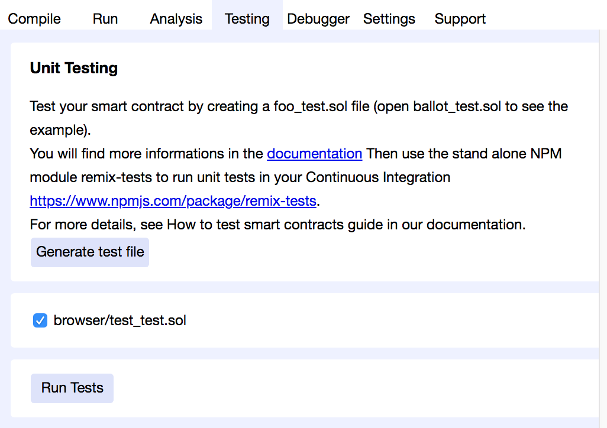
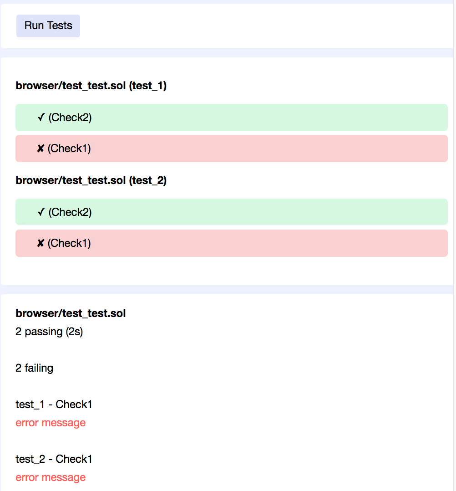
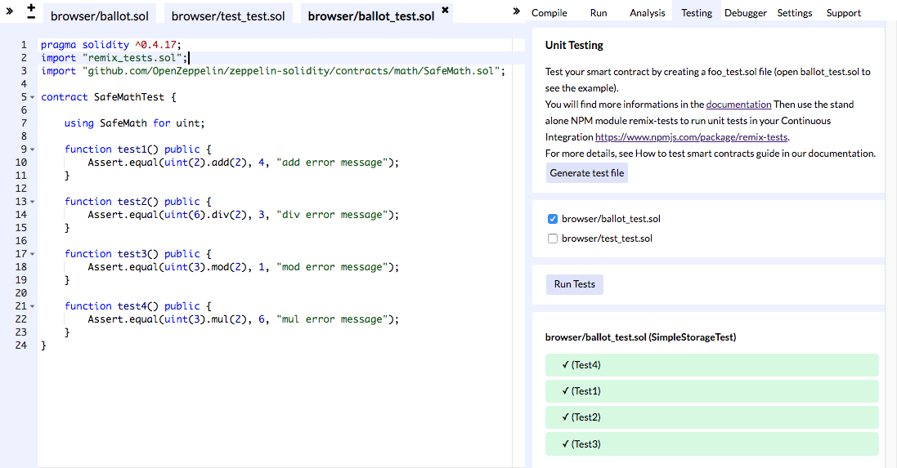
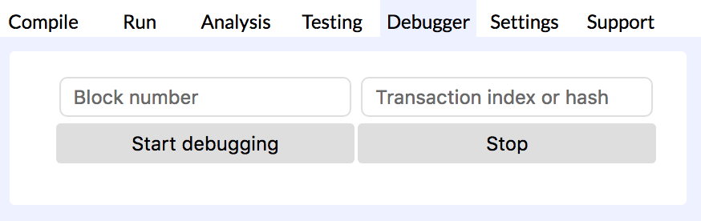
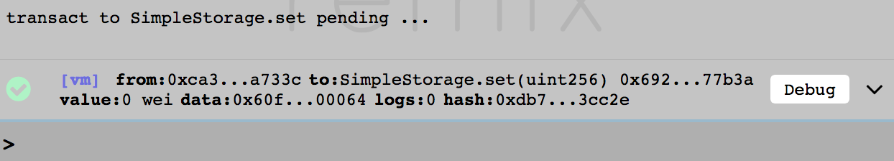
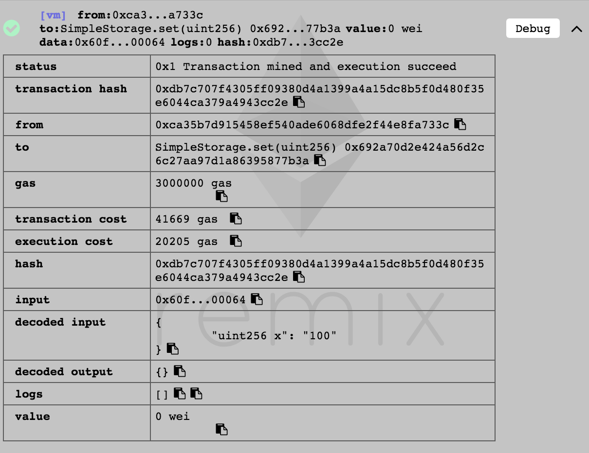
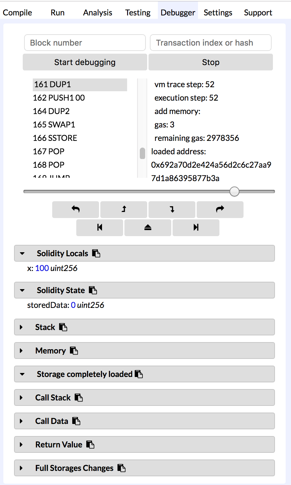

# 線上版 IDE 之 Remix 進階篇

### 測試頁籤 (Testing)



按一下 `Generate test file`，它就會產生一個測試範例給你。

```js
pragma solidity ^0.4.0;
import "remix_tests.sol"; // this import is automatically injected by Remix.

// file name has to end with '_test.sol'
contract test_1 {
    
    function beforeAll () {
      // here should instanciate tested contract
    }
    
    function check1 () public {
      // this function is not constant, use 'Assert' to test the contract
      Assert.equal(uint(2), uint(1), "error message");
      Assert.equal(uint(2), uint(2), "error message");
    }
    
    function check2 () public constant returns (bool) {
      // this function is constant, use the return value (true or false) to test the contract
      return true;
    }
}

contract test_2 {
   
    function beforeAll () {
      // here should instanciate tested contract
    }
    
    function check1 () public {
      // this function is not constant, use 'Assert' to test the contract
      Assert.equal(uint(2), uint(1), "error message");
      Assert.equal(uint(2), uint(2), "error message");
    }
    
    function check2 () public constant returns (bool) {
      // this function is constant, use the return value (true or false) to test the contract
      return true;
    }
}
```

按下 `Run Test` 按鈕後，就可以看到測試結果。



如果你要手動建立一個測試，你只要將智能合約的檔案命名為 `_test.sol` 結尾，例如 `ballot_test.sol`。第二行需要加 `import "remix_tests.sol";`，就可以呼叫與測試相關的函示。

**Assert 函式庫**

| 函式名稱  | 支援的類別 |
| ------------- | ------------- |
| `Assert.ok()`  | `bool`  |
| `Assert.equal()`  | `uint`, `int`, `bool`, `address`, `bytes32`, `string`  |
| `Assert.notEqual()` | `uint`, `int`, `bool`, `address`, `bytes32`, `string`  |
| `Assert.greaterThan()` | `uint`, `int` |
| `Assert.lesserThan()` | `uint`, `int` |

源自：<https://github.com/ethereum/remix/tree/master/remix-tests>

**第一個測試範例**

```js
pragma solidity ^0.4.17;
import "remix_tests.sol";
import "github.com/OpenZeppelin/zeppelin-solidity/contracts/math/SafeMath.sol";

contract SafeMathTest {
    
    using SafeMath for uint;

    function test1() public {
        Assert.equal(uint(2).add(2), 4, "add error message");
    }
    
    function test2() public {
        Assert.equal(uint(6).div(2), 3, "div error message");
    }
    
    function test3() public {
        Assert.equal(uint(3).mod(2), 1, "mod error message");
    }
    
    function test4() public {
        Assert.equal(uint(3).mul(2), 6, "mul error message");
    }
}
```



### Debugger 頁籤



可以讓你輸入 `transaction hash`，然後按下 `Start debugging` 按鈕，就可以看到 `Transaction` 的逐步執行結果。那要怎麼找到 `transaction hash` 呢？



當你在執行函式時，下方的控制台 (terminal) 會出現一些 log 訊息，把 log 展開，可以看到更詳細的內容，這裡面就有 `transaction hash`。



或者你也可以在上面那張圖中的 `Debug` 按鈕按一下，它會直接開始執行 `Start debugging`。結果如下圖所示：



### 小結

工欲善其事，必先利其器。測試跟 debug 往往是最花時間的，千萬要記得花時間摸熟它。