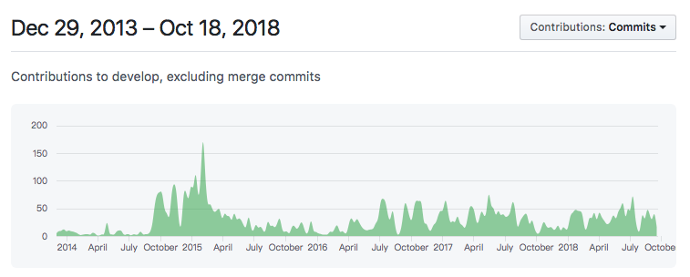

# 介紹 Solidity 語言

`Solidity` 是一種合約是導向程式語言，它受到 `C++`、`Python` 和 `Javascript` 語言影響，語法設計參考了 `ECMAScript`，所以對於有寫過 `Javascript` 的人，相對好上手，用來撰寫智能合約。`Solidity` 是靜態型語言，編譯後可以在 `EVM` 上執行。



撰寫智能合約，除了可以用 `Solidity` 語言之外，還有 [Vyper](https://github.com/ethereum/vyper) 語言可以選擇。`Solidity` 語言處於持續開發階段，變動非常的頻繁。

**EVM (Ethereum Virtual Machine)**

`EVM` 可翻譯為以太坊虛擬機，是智能合約的運行環境。

### 一個最基本的智能合約

```
pragma solidity ^0.4.25;

contract SimpleStorage {
    uint storedData;

    function set(uint x) public {
        storedData = x;
    }

    function get() public view returns (uint) {
        return storedData;
    }
}
```

第一行一定要是 `pragma` 開頭，用來指示編輯器如何編譯原始碼，0.4.25 指的是 `solidity` 的版本。`contract` 是保留字，用法類似於其他程式語言的 `class`。

Solidity 0.4.25 文件：<http://solidity.readthedocs.io/en/v0.4.25/>
