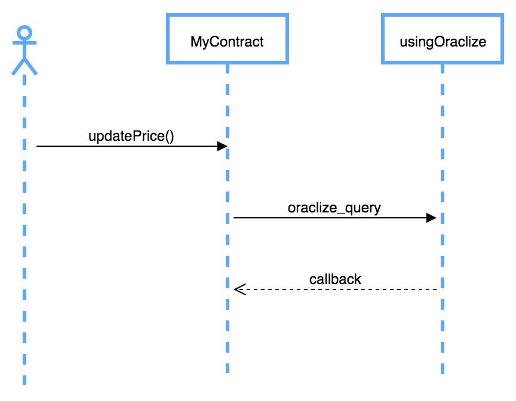

## oraclize_query 函式



`oraclize_query` 函式，是從 `oraclizeAPI` 合約繼承而來，功用是叫 Oraclize 服務幫我們取得外部的值，非同步的方式傳到我們實作的 `__callback` 函式之中。

### 實作 oraclize_query 函式

`oraclize_query` 是 Oraclize 智能合約 API 所提供的一個函式。我們用一個簡單完整的範例來解釋 oraclize_query 執行流程。

#### 第一步：匯入 `oraclizeAPI`

```js
import "github.com/oraclize/ethereum-api/oraclizeAPI.sol";
```

#### 第二步：繼承 `usingOraclize` 合約

```
contract ExampleContract is usingOraclize
```

#### 第三步：呼叫 `oraclize_query` 函式


<https://www.therocktrading.com/api/ticker/ETHEUR> API 回傳值如下：

```json
{
  trade_id: 41500686,
  price: "196.76000000",
  size: "0.06832073",
  bid: "196.75",
  ask: "196.76",
  volume: "58484.42274641",
  time: "2018-11-01T13:20:29.383000Z"
}
```

**結合 Parsing Helper**

把 url 用 () 包住，然後在指定用哪種 parser helper，這裡使用的是 `json` 格式。

```js
oraclize_query(
  "URL", 
  "json(https://api.gdax.com/products/ETH-USD/ticker).price");
```

#### 第四步：實作 `__callback` 函式

`__callback` 函式名稱是固定的，不能取別的名字，在函式內的第一行需要先驗證，呼叫此函式的來源真的是從 oraclize 主機，不接受來路不明丟過來的值。`result` 就是從外部取得的值，

```js
function __callback(bytes32 queryId, string result) {
  if (msg.sender != oraclize_cbAddress()) revert();
  // 略
}
```

### 完整範例

```js
pragma solidity ^0.4.25;
// Step 1: 匯入 API
import "github.com/oraclize/ethereum-api/oraclizeAPI.sol";

// Step 2: 繼承 usingOraclize 合約
contract ExampleContract is usingOraclize {

  string public ETHUSD;

  function updatePrice() payable {
    // Step 3: 呼叫 oraclize_query 函式
    oraclize_query(
      "URL", 
      "json(https://api.gdax.com/products/ETH-USD/ticker).price"
    );
  }
  
  // Step 4: 實作 `__callback` 函式
  function __callback(bytes32 myid, string result) {
    if (msg.sender != oraclize_cbAddress()) revert();
    ETHUSD = result;
  }
}
```

### 補充：Oraclize 外掛

首先你先要把 Oraclize 的外掛打開，它位在 Remix (<http://remix.ethereum.org/>) 的 setting 頁籤，裡面有一個 Oraclize 按鈕。


你可以試著上面那段程式碼複製到 Remix IDE 執行看看，這個外掛可以讓你很方便看到回應的結果。

