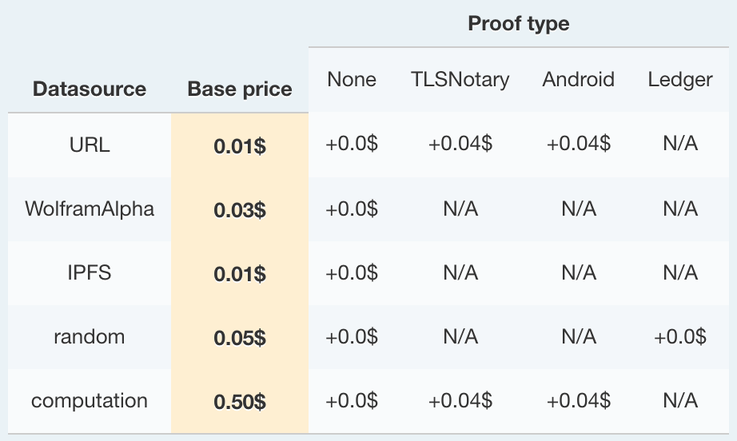

# Oraclize 可靠證明

Oraclize 提供資料的可靠證明 (Authenticity Proof) 服務，確保資料的真偽。

**證明的型態**

* `TLSNotary` 證明
* `Android` 證明
* `Ledger` 證明

**儲存和傳遞**

如果將可靠證明存在區塊量上會非常昂貴，所以 Oraclize 將可靠證明保存在 `IPFS` 裡。`IPFS` 本身並沒有提供永久保存，但 Oraclize 的基礎建設是使用 IPFS persistence consortium：<https://github.com/pipermerriam/ipfs-persistence-consortium>。

> `IPFS`：是分散式檔案儲存系統

**完整範例**

```js
// Step1: 繼承 usingOraclize
contract proofShieldExample is usingOraclize {

    event LogNewAuthenticatedResult(string);
    mapping (bytes32 => bool) public pendingQueries;

    function proofShieldExample() payable {
        // Step2: 設定使用哪種證明
        oraclize_setProof(proofType_Android_v2 | proofShield_Ledger);
    }

    // Step3: __callback 的 proof 參數
    function __callback(bytes32 queryId, string result, bytes proof) {
        if (!pendingQueries[queryId]) revert();
        if (msg.sender != oraclize_cbAddress()) revert();

        // Step4: 驗證可靠證明
        if (oraclize_proofShield_proofVerify__returnCode(queryId, result, proof) != 0) {
            // 驗證失敗流程
        } else {
            // 驗證成功流程
            delete pendingQueries[queryId];
            LogNewAuthenticatedResult(result);
        }
    }

    function sendQuery() payable {
        string memory query = "json(https://www.bitstamp.net/api/v2/ticker/ethusd/).last";
        bytes32 queryId = oraclize_query("URL", query);
        pendingQueries[queryId] = true;
    }
}
```

### 自訂 gas limit 和 gas 價格

只有第一次呼叫 oraclize_query 是免費的，之後都需要花費 gas，費用的計算方式為資料來源的費用加上證明費用。

```
Datasource base price + Proof price = 總費用
```

例如：從 URL 取得資料，並使用 `TLSNotary` 證明，成本是：

```
0.01 + 0.04 = 0.05 USD
```



**完整範例**

```js
contract proofShieldExample is usingOraclize {

    // Step1: 宣告自訂 gas limit
    uint constant CUSTOM_GASLIMIT = 150000;

    event LogNewAuthenticatedResult(string);
    mapping (bytes32 => bool) public pendingQueries;

    function proofShieldExample() payable {
        // Step2: 設定自訂 gas 價格
        oraclize_setCustomGasPrice(4000000000);
        oraclize_setProof(proofType_Android_v2 | proofShield_Ledger);
    }

    function __callback(bytes32 queryId, string result, bytes proof) {
        if (msg.sender != oraclize_cbAddress()) revert();

        if (oraclize_proofShield_proofVerify__returnCode(queryId, result, proof) != 0) {
            // 驗證失敗流程
        } else {
            // 驗證成功流程
            require(pendingQueries[queryId] == true);
            delete pendingQueries[queryId];
            LogNewAuthenticatedResult(result);
        }
    }

    function sendQuery() payable {
        string memory query = "json(https://www.bitstamp.net/api/v2/ticker/ethusd/).last";
        // Step3: 檢查是否有足夠的錢
        require(oraclize_getPrice("URL", CUSTOM_GASLIMIT) < this.balance), "not enough money");

        // Step4: 指定 query 的 gas limit
        bytes32 queryId = oraclize_query("URL", query, CUSTOM_GASLIMIT);
        pendingQueries[queryId] = true;
    }
}
```

### 參考

* [IPFS Consortium Release ：Persistent data in a decentralized world. by Sponnet](https://press.swarm.city/ipfs-consortium-release-6907f0b55bbf)