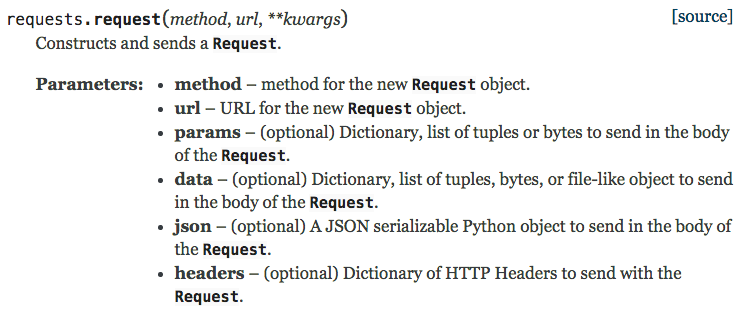
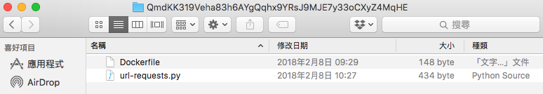

# Oraclize 的 computation 資料來源


如果你需要使用進階的 HTTP 用法，例如 Basic Authentication 或 OAuth，你必須要用 computation 資料來源。

#### 用五個步驟來實作 computation

**Step1: 撰寫自訂的 `Dockerfile` 檔案**

你可以透過這個檔案配置 script 的執行環境，Oraclize 會監聽最後一行的執行結果，回傳至 Oraclize 伺服器。

```yml
FROM frolvlad/alpine-python3
MAINTAINER Oraclize "info@oraclize.it"

COPY url-requests.py /

RUN pip3 install requests
CMD python ./url-requests.py
```

**Step2: 撰寫客製的 script**

`url-requests.py` 檔案

```py
!/usr/bin/python

import sys
import ast
import requests
import os

# 將 ARG 環境變數存入 arg 陣列
arg = [os.environ['ARG0'], os.environ['ARG1']]

# parse 3rd arg into kwargs if available
if 'ARG2' in os.environ: kwargs = ast.literal_eval(os.environ['ARG2'])
else: kwargs = {}

# 發送 request
req = requests.request(arg[0], arg[1], **kwargs)

# print(json.loads(req.text))
# 將結果印成一行
print(req.text.replace('\n',''))
```

Python 文件




**Step3: 將所有檔案壓縮成一個 `archive.zip` 檔**

把 Dockerfile 跟其他要用的檔案，全部壓縮在一個 `archive.zip` 檔案裡。



**Step4: 上傳 `archive.zip` 檔案到 `IPFS`**

將壓縮檔上傳至 IPFS 之後，你就會拿到一組 IPFS 的 hash。

```
ipfs daemon
ipfs add archive.zip

// 輸出訊息:
// added QmRxtL9K2de7v7QBYCCrwcjZHjYmuKggZ8xaqZ6UUWvd1s archive.zip
```

**Step5: 實作 oraclize query 函式**

**語法**

```js
function oraclize_query(string datasource, string[4] args) 
    oraclizeAPI internal returns (bytes32 id)
```

這裡的 `args` 陣列值，最終會轉換成執行環境的 `ARG0`、`ARG1`、`ARG2`、`ARG3` 變數。

#### 完整範例

```js
pragma solidity ^0.4.25;

// Step 1: 匯入 API
import "github.com/Arachnid/solidity-stringutils/strings.sol";
import "github.com/oraclize/ethereum-api/oraclizeAPI.sol";

// Step 2: 繼承 usingOraclize 合約
contract ExampleContract is usingOraclize {
  using strings for *;

  function request(string _access_token) payable {
    // Step 3: 呼叫 oraclize_query 函式
    string memory _query = "json(QmdKK319Veha83h6AYgQqhx9YRsJ9MJE7y33oCXyZ4MqHE).user.displayName";
    string memory _method = "GET";
    string memory _url = "https://api.fitbit.com/1/user/-/profile.json";
    string memory _kwargs = strConcat(
      "{'headers':{ 'content-type': 'json', 'Authorization': 'Bearer ",
      _access_token,
      "'}}"
    );

    bytes32 queryId = oraclize_query(
      "computation",
      [ _query,
        _method,
        _url,
        _kwargs
      ]
    );
  }
  
  // Step 4: 實作 `__callback` 函式
  function __callback(bytes32 myid, string result) {
    if (msg.sender != oraclize_cbAddress()) revert();
    // 略
  }
}
```

#### Token 加密

透過 Oraclize 提供的 HTTP API 先將 Token 加密後，在傳給智能合約。

```js
// javascript
function encryptHeader(token, next) {
  const header = `{'headers': {'content-type': 'json', 'Authorization': 'Bearer ${token}'}}`;
  encrypt({ "message" : header }, function (data) {
    if (data.success) {
      next(null, data.result);
    } else {
      next(new Error("encrypt header fail"));
    }
  });
}

function encrypt(data, next) {
  const init = {
    method: 'POST',
    body: JSON.stringify(data),
  };

  fetch('https://api.oraclize.it/v1/utils/encryption/encrypt', init)
    .then(processResponse)
    .then(next)
    .catch(console.error);
}
```

```js
// 智能合約
function request(string _encryptHeader, string _userId) public payable {
    string memory _query 
        = "json(QmdKK319Veha83h6AYgQqhx9YRsJ9MJE7y33oCXyZ4MqHE).lifetime.total.steps";
    string memory _method = "GET";
    string memory _url = "https://api.fitbit.com/1/user/-/activities.json";
    bytes32 queryId 
        = oraclize_query("computation", [ _query, _method, _url, _encryptHeader]);
}
```

### 延伸閱讀

* [oraclize_query with encrypted API key no longer works · Issue #20 · oraclize/ethereum-api · GitHub](https://github.com/oraclize/ethereum-api/issues/20)