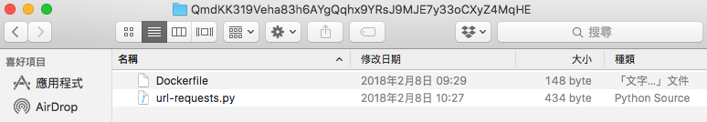
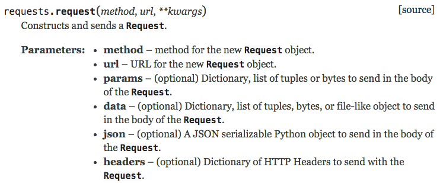

# 使用 Oraclize 的 computation 資料來源型態

#### Type : computation


More advanced HTTP capabilities, such as Basic Authentication or OAuth, can be build by leveraging the computation data source type.

跟隨這五個步驟來實作 computation

**Step1: write your own Dockerfile**

```docker
FROM frolvlad/alpine-python3
MAINTAINER Oraclize "info@oraclize.it"

COPY url-requests.py /

RUN pip3 install requests
CMD python ./url-requests.py
```

**Step2: write your script, e.g. "url-requests.py"**

```py
!/usr/bin/python

import sys
import ast
import requests
import os

# parse env args
arg = [os.environ['ARG0'], os.environ['ARG1']]

# parse 3rd arg into kwargs if available
if 'ARG2' in os.environ: kwargs = ast.literal_eval(os.environ['ARG2'])
else: kwargs = {}

# attempt the request
req = requests.request(arg[0], arg[1], **kwargs)

# print text result on single line
# print(json.loads(req.text))
print(req.text.replace('\n',''))
```

be careful last line,
output will send to Oraclize Service.

**Step3: zip all files in the "archive.zip"**



**Step4: upload "archive.zip" to IPFS, then get the IPFS hash**

```
ipfs daemon
ipfs add archive.zip

// output message:
//
// added QmRxtL9K2de7v7QBYCCrwcjZHjYmuKggZ8xaqZ6UUWvd1s archive.zip
```

**Step5: implement oraclize query**

```js
function oraclize_query(string datasource, string[4] args) 
    oraclizeAPI internal returns (bytes32 id)
```

"QmdKK31...yZ4MqHE" -> get from step4
second parameter is "string[4] args"

```js
import "github.com/Arachnid/solidity-stringutils/strings.sol";
using strings for *;

string _query = "json(QmdKK319Veha83h6AYgQqhx9YRsJ9MJE7y33oCXyZ4MqHE).user.displayName";
string _method = "GET";
string _url = "https://api.fitbit.com/1/user/-/profile.json";
string _kwargs = strConcat(
    "{'headers': {'content-type': 'json', 'Authorization': 'Bearer ",
    _access_token,
    "'}}"
    );

bytes32 queryId = oraclize_query("computation",
            [ _query,
             _method,
             _url,
             _kwargs]
        );
```

smart contract

```
bytes32 queryId = oraclize_query(
  "computation",
  [ _query,
    _method,
    _url,
    _kwargs]
);
```

url-requests.py

```py
req = requests.request(arg[0], arg[1], **kwargs)
```



但我們沒有把 token 加密

```js
string _kwargs = strConcat(
    "{'headers': {'content-type': 'json', 'Authorization': 'Bearer ",
    _access_token,
    "'}}"
    );
```

#### encryption of the token

**javascript**

```js
function encryptHeader(token, next) {
  const header = `{'headers': {'content-type': 'json', 'Authorization': 'Bearer ${token}'}}`;
  encrypt({ "message" : header }, function (data) {
    // console.log(data);
    if (data.success) {
      next(null, data.result);
    } else {
      next(new Error("encrypt header fail"));
    }
  });
}

function encrypt(data, next) {
  const init = {
    method: 'POST',
    body: JSON.stringify(data),
  };

  fetch('https://api.oraclize.it/v1/utils/encryption/encrypt', init)
    .then(processResponse)
    .then(next)
    .catch(console.error);
}
```

**智能合約的部分**

```js
function request(string _encryptHeader, string _userId) public payable {
    string memory _query 
        = "json(QmdKK319Veha83h6AYgQqhx9YRsJ9MJE7y33oCXyZ4MqHE).lifetime.total.steps";
    string memory _method = "GET";
    string memory _url = "https://api.fitbit.com/1/user/-/activities.json";
    bytes32 queryId 
        = oraclize_query("computation", [ _query, _method, _url, _encryptHeader]);
}
```