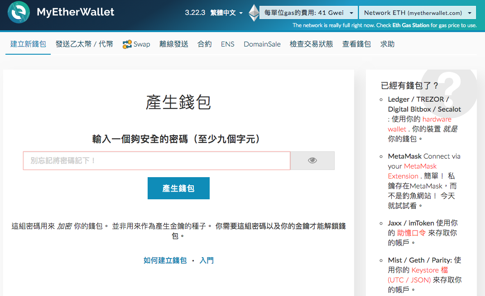

# 錢包 (wallet)

錢包就是管理鑰匙的工具軟體

我們前一篇有提到，當新增一個交易時，使用者需要進行「交易確認」，

我們並不是直接跟網路協定溝通，而是透過友的善瀏覽器介面，例如 chrome、firefox、IE 來讀取跟發佈資料。

**常見功能**

* 新增帳戶
* 匯入帳戶
* 進行轉帳
* 查詢餘額
* 交易的確認

### MetaMask

* 官網：<https://metamask.io/>
* Chrome Plugin

* 備份 Keystore，Keystore 如同一個加密的私鑰。

### example

* send money to other people

### Mise

* [MetaMask Compatibility Guide](https://github.com/MetaMask/faq/blob/master/DEVELOPERS.md)

### Mist Wallet
  
* 下載安裝檔：<https://github.com/ethereum/mist/releases>
* 相依於 `Geth`，所以使用 Mist Wallet 時，需要先啟動 `Geth`。

### E-wallet

* [GitHub - PaulLaux/eth-hot-wallet: Ethereal wallet with erc20 support / web wallet - built using react, web3, eth-lightwallet and others](https://github.com/PaulLaux/eth-hot-wallet)
* [GitHub - ConsenSys/eth-lightwallet: Lightweight JS Wallet for Node and the browser](https://github.com/ConsenSys/eth-lightwallet)
* [GitHub - kvhnuke/etherwallet](https://github.com/kvhnuke/etherwallet)

### MyEtherWallet

* <https://www.myetherwallet.com/>
* 網頁版

## 紙錢包

## 硬體錢包 (Hardware Wallet)

### TREZOR

### Ledger Wallet

<!-- keystore -->

### 小結

你可能會有點疑惑，開發智能合約跟電子錢包有什麼關係？但實際上，當你需要部署 Smart Contract 時，它會跟你收取一些 gas 當手續費，作為礦工幫你寫入資料到 blockchain 的獎勵，所以發佈 Smart Contract 你必須要有一個 EOA 帳戶，這部分可以透過電子錢包介面，無痛快速建立一個帳戶。MetaMask 錢包也是未來與 DApp 互動最好簡單的方式。